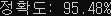
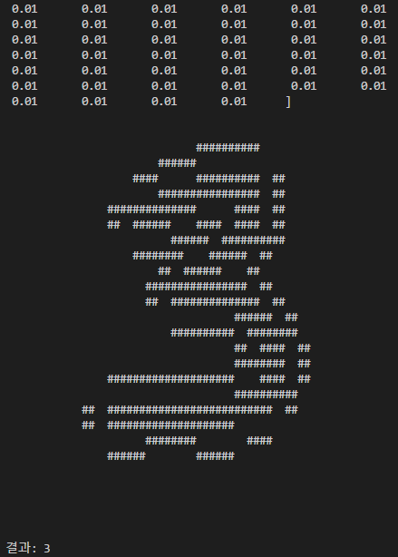
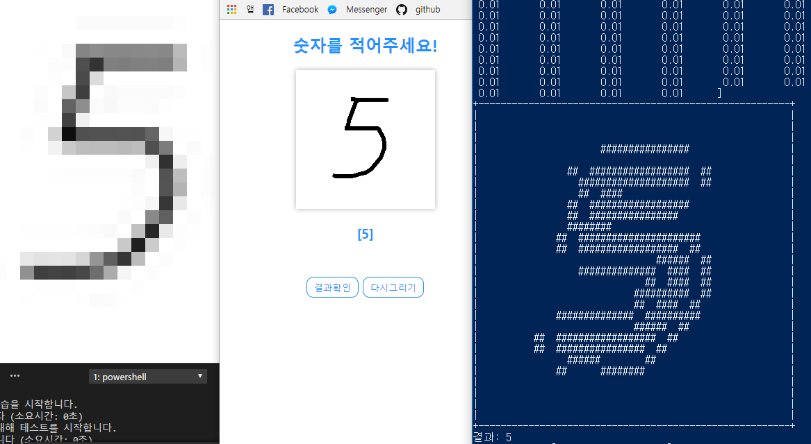

# python-neural-network
- 파이썬으로 구현 된 신경망 기초 예제입니다.

# 의존 라이브러리 설치
본 예제는 `numpy`와 `scipy` 라이브러리를 사용합니다.

```bash
pip install numpy
pip install scipy
```

서버 예제를 실행하시려면 `Flask`와 `PIL` 라이브러리도 설치해야합니다.
```bash
pip install flask
pip install pillow
```

# 실행
- 실행 전 학습 데이터 및 테스트 데이터가 존재해야합니다.
- 아래 [MNIST 데이터](#mnist-데이터) 항목에서 확인 가능합니다.
```bash
python neural_network.py
```
# 서버 예제 실행
직접 손글씨를 그린 후 신경망을 통해 결과를 확인해 볼 수 있습니다.
```bash
# 현재 디렉토리에서 실행할 경우
python ./server/server.py
```

# 결과
<br>
위 결과는 60000개의 레코드 학습 및 10000개의 레코드를 테스트 한 결과입니다.
- 학습률(코드 내의 learning_rate)은 `0.1` 로 진행
- 초기 가중치는 랜덤이기 때문에 매번 달라질 수 있음

# 서버 예제 결과
- 클라이언트
<br>

<br>
    - 결과 확인 버튼을 누르면 분석 후 `[]` 안에 결과를 출력합니다.

- 서버 콘솔
<br>

<br>

- 서버 결과
<br>

<br>
    - 캔버스에서 그려진 숫자 데이터는 Base64 해시 데이터로 서버로 전달됩니다.
    - 전달된 이미지 데이터는 서버에서 `28x28 크기의 이미지`로 변환되어 신경망에 질의됩니다.
    - 변환된 이미지는 현재 폴더에 `convert.png` 파일로 저장됩니다.


# MNIST 데이터
자세한 내용은 [여기](https://github.com/leegeunhyeok/python-neural-network/blob/master/mnist_dataset/MNIST_DATA.md)에서 확인 가능합니다.

# 참고자료
도서: 신경망 첫걸음